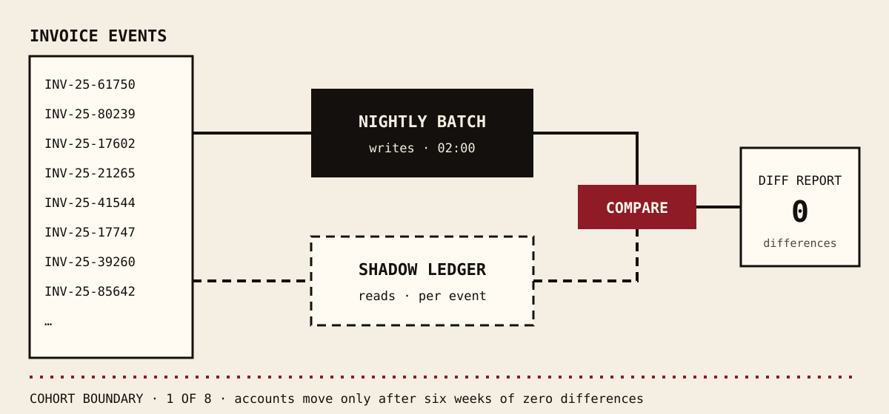

## The brief

Meridian's freight invoices were posted by one nightly batch against a vendor-owned database. When
the batch failed, nobody knew until morning. When it retried, it paid twice. Finance closed each
month by exporting everything to a spreadsheet and matching lines by hand for three hours.

The ask was a ledger that posts invoices as they arrive, reconciles continuously, and can be switched
on without a single minute of downtime in the close window.

## What shipped

A double-entry ledger service that receives invoice events, posts them per account in order, and
reconciles incrementally instead of once a month. .

The old batch ran beside the new ledger for six weeks as a shadow, and every posting was compared
before the ledger was allowed to write. Accounts then moved across in eight cohorts.

*Tomás Reyes, Meridian Freight and every figure on this page are fictional; they demonstrate the theme.*
